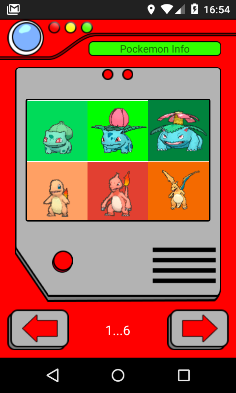
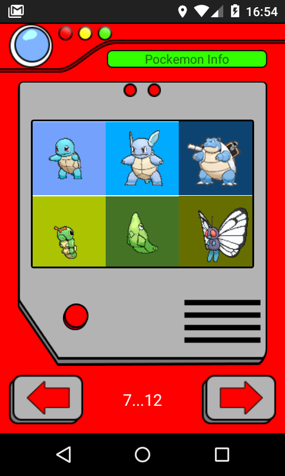
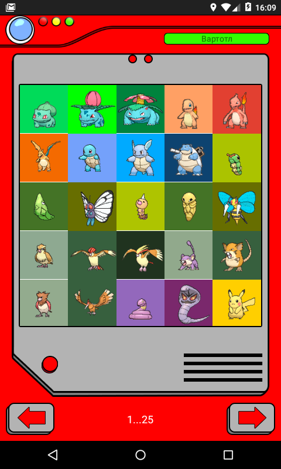
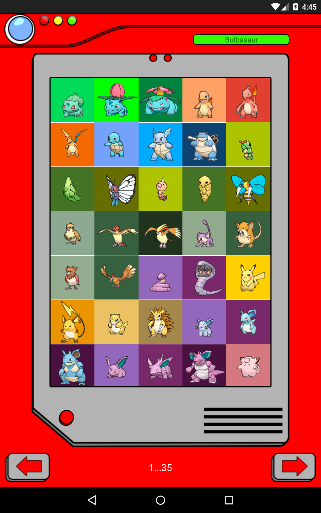

# Pokevoice

This application will provide you with the voices of Pokémons, featured in the first generation of Nintendo games and the first seasons of the original Pokémon anime. Here you will find a complete list of 151 species from Bulbasaur to Mew.

Pokémon is a trademark and © of Nintendo Co., Ltd.
All graphics and sounds are taken from free sources and belong to their authors.

## Phone screen

## Tablet screen

## Large tablet screen

